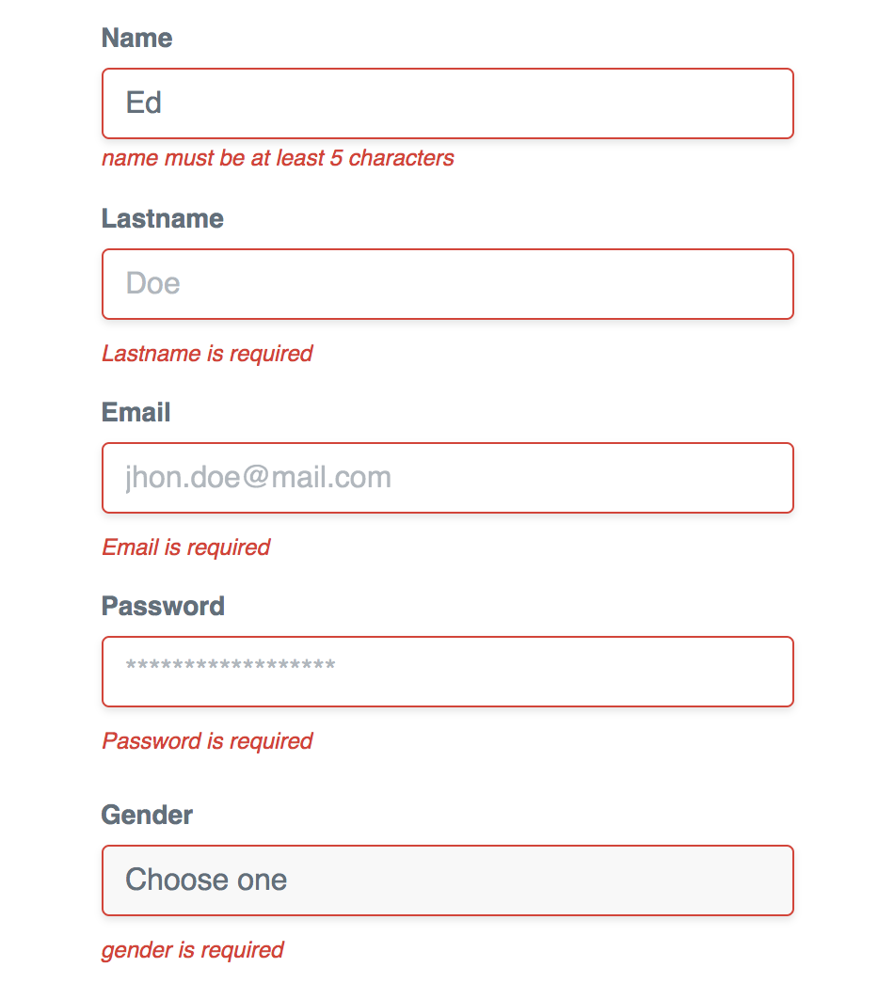

# vue-mandatory

Simple and easy Vue.js directive for form validation.

# Steps

1. Install it

```javascript
  npm install --save vue-mandatory
```

2. Import the library and use it as Vue plugin.

```javascript
  import vueMandatory from 'vue-mandatory'

  Vue.use(vueMandatory)
  
```
3. You can import it directly in your vue file too.

```javascript
  <template>...</template>
  <script>
  import vueMandatory from 'vue-mandatory'

   export default {
     ...,
     name: 'my-component',
     directives: {
      vueMandatory
     },
     data () {
       return {}
     }
   }
  </script>
```

4. Basic usage.
    * Use the directive **v-mandatory** in your HTML form elements.
    * The directive **v-mandatory** receive an object as value.
    * **Mandatory** each HTML form element must have an id property setted.
    * Optional params:
      * msg: String type. Is the message displayed if an element is required. If the msg is not supplied, the default value is `${elementId} is required`
      * len: Number type. Is the minimum length required. Apply only for inputs. If the len is not supplied, the default value is 1.
      * pattern: Regex type. If a pattern is setted the input value must match the pattern for be valid.
      * inputClasses: Array of clases that will be apply to the input element in case of non-compliance.
      * warningClasses: Array of clases that will be apply to message element in case of non-compliance. The message element is build with an p tag and is append below the input element.
    * You can assing an object, with the custom fields, as value of the v-mandatory directive such as the email and password inputs in the following example.
    * You can assign custom values directly such as username input.
    * or only use without values such as gender select. In this way you will get the defaults values based on TailwindCSS for the styles.
```html
 <template>
   ...
   <div class="mb-4">
    <label class="block text-grey-darker text-sm font-bold mb-2" for="username">
      Username
    </label>
    <input
      class="shadow appearance-none border rounded w-full py-2 px-3 text-grey-darker leading-tight focus:outline-none focus:shadow-outline"
      id="username"
      type="text"
      placeholder="jhonDoe"
      v-model="form.username"
      v-validate="{ msg: 'My custom message here', len: 5, pattern: /[a-zA-Z]{5, 10}/i inputClasses: ['error'], warningClasses: ['background-red', 'text-bold'] }"/>
  </div>
  <div class="mb-4">
    <label class="block text-grey-darker text-sm font-bold mb-2" for="email">
      Email
    </label>
    <input
      class="shadow appearance-none border rounded w-full py-2 px-3 text-grey-darker leading-tight focus:outline-none focus:shadow-outline"
      id="email"
      type="email"
      placeholder="jhon.doe@mail.com"
      v-model="form.email"
      v-validate="{ msg: validate.email.msg, inputClasses: validate.inputClasses, warningClasses: validate.warningClasses, pattern: validate.email.pattern }" />
  </div>
   <div class="mb-6">
    <label class="block text-grey-darker text-sm font-bold mb-2" for="password">
      Password
    </label>
    <input
      class="shadow appearance-none border rounded w-full py-2 px-3 text-grey-darker leading-tight focus:outline-none focus:shadow-outline"
      id="password"
      type="password"
      placeholder="******************"
      v-model="form.password"
      v-validate="{ msg: validate.password.msg, len: validate.password.len, inputClasses: validate.inputClasses, warningClasses: validate.warningClasses }" />
  </div>
  <div class="mb-6">
    <label class="block text-grey-darker text-sm font-bold mb-2" for="password">
      Gender
    </label>
    <select
      class="shadow appearance-none border rounded w-full py-2 px-3 text-grey-darker leading-tight focus:outline-none focus:shadow-outline"
      id="gender"
      v-model="form.gender"
      v-validate>
        <option value="">Choose one</option>
        <option value="male">Male</option>
        <option value="female">Female</option>
        <option value="other">Other</option>
    </select>
    </div>
   ...
 </template>
 <script>
   import vueMandatory from 'vue-mandatory'

   export default {
     ...,
     directives: {
       vueMandatory
     },
     data () {
       return  {
         validate: {
           email: {
             msg: 'The Email Field is required',
             pattern: /^[a-zA-Z0-9.!#$%&'*+/=?^_`{|}~-]+@[a-zA-Z0-9](?:[a-zA-Z0-9-]{0,61}[a-zA-Z0-9])?(?:\.[a-zA-Z0-9](?:[a-zA-Z0-9-]{0,61}[a-zA-Z0-9])?)*$/i
           }
           password: {
             msg: 'Password is mandatory',
             len: 6
           },
           gender: {
             msg: 'Choose one gender'
           },
           inputClasses: ['border-red'],
           warningClasses: ['mt-3', 'text-red', 'text-xs', 'italic']
         }
       }
     },
     ...
   }
 </script>
```



## License

MIT © Edward S. Ramos
